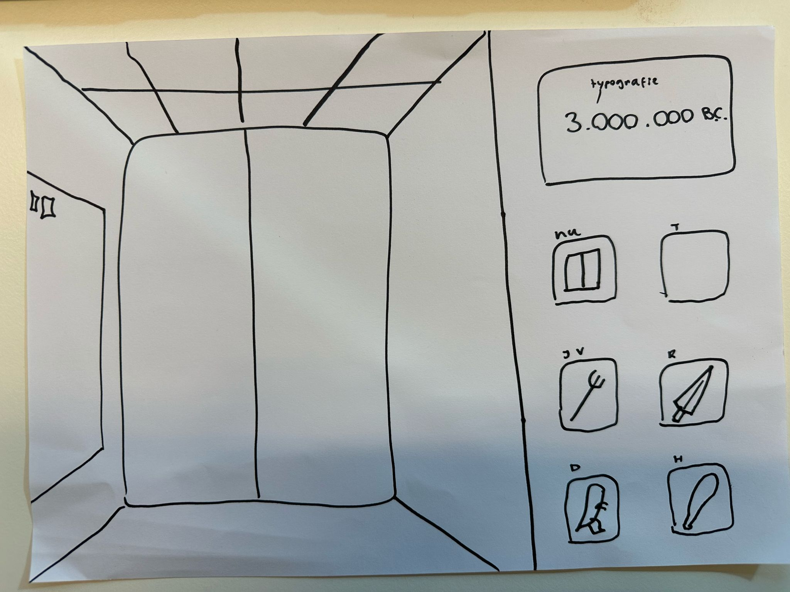
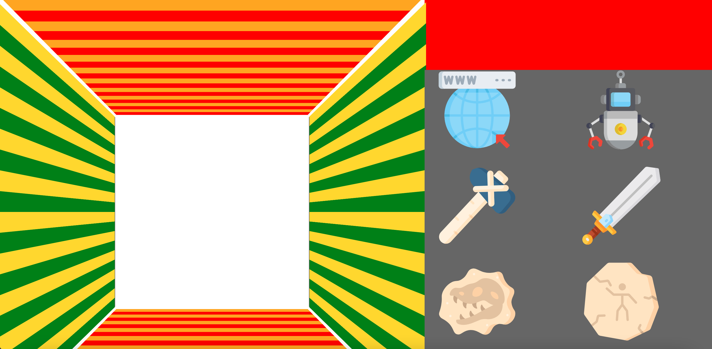
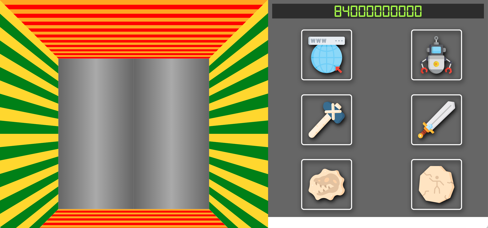
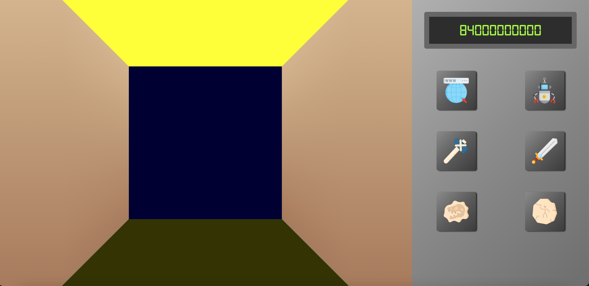
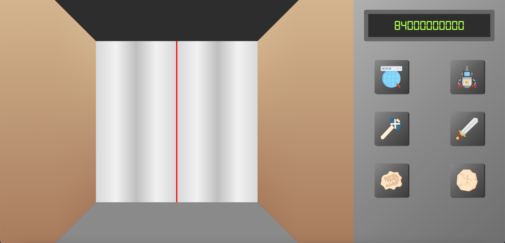
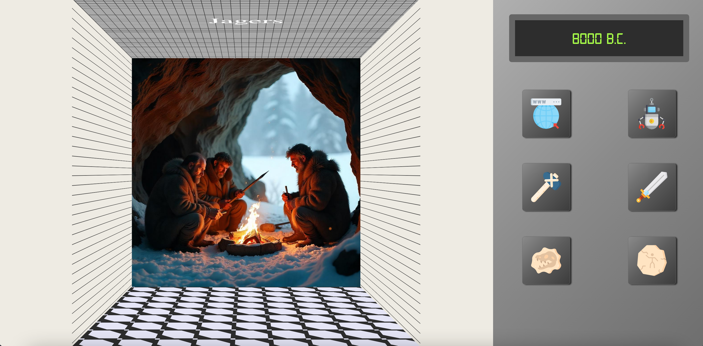

# CSS-to-the-rescue

**Week 1, eerste feedbacksessie en plan bespreken**

Mijn plan is om een pov vanuit een lift te maken, en een control panel rechts om de lift te bedienen. De lift is een soort tijdmachine die door de tijd heen gaat, de 'laagste' verdieping is de tijd van de dino's, de 'hoogste' verdieping is in de toekomst. 

Als de lift beweegt wil ik hem laten trillen, zodat het echt lijkt alsof de lift omhoog beweegt. Ook wil ik de nummers laten draaien tot ze bij het juiste jaartal zijn. Een beetje het effect van een slot machine. 

**Week 2, maandag 3 mrt**
Vandaag, met hulp van Stijn, de knoppen naast de lift gezet. We hebben hiervoor gebruik gemaakt van een grid. Vervolgens heb ik de animatie die er al in stond op de hover, op de knoppen gezet. Al met al heb ik een hoop gedaan vandaag en ik ben blij met de vooruitgang.

Wat ik morgen graag wil doen is het volgende:
 - Het scherm voor de jaartallen
 - Een 'digitaal' font inladen
 - De knoppen er meer als knoppen uit laten zien (border?)
 

**Week 2, dinsdag 4 mrt**
Wat ik op de planning had staan voor vandaag heb ik kunnen doen. Het duurde wel de hele dag maar het is uiteindelijk gelukt. Nieuwe dingen die ik vandaag gedaan heb zijn:
 - Een font inladen
 - Een drop shadow geven (aan de buttons)
 - Gebruik gemaakt van border-box om een border aan de binnenkant te krijgen (schermpje met jaartallen)

Ik ben ook begonnen met het expirimenteren van :has om de knoppen van de lift het gewenste effect te laten doen. Volgende keer wil ik het volgende doen:
 - De buttons de deur laten sluiten en weer openen
 - De divjes (muren) om de liftdeuren stylen
 - De tekst aanpassen bij het drukken op de buttons (:has?)

 

 **Week 3, maandag 10 mrt**
Vandaag heb ik veel zitten kloten met het design. Het ging steeds stuk en de responsiveness was weg. Ik heb besloten om een nieuwe index.html bestand te maken zodat ik wat meer overzicht heb. Vervolgens ben ik naar Nils gegaan om samen de lift opnieuw te maken, zodat ik het wat beter snap. Ik begrijp nu beter hoe de lift in elkaar zit en de scaling werkt ook top. 

De deur-animatie wil ik eigenlijk zelf opnieuw gaan maken met overflow: hidden. Als dat niet lukt pak ik de animatie uit mijn vorige html bestand. 

Belangrijke dingen die ik heb geleerd vandaag:
- @media properties: orientation: landscape & portrait 

**Week 3, dinsdag 11 mrt**
Deze dag heb ik op de planning staan om de verschillende knoppen de liftdeuren te laten openen. Ik had de verschillende knoppen al aangeroepen met :has, ik heb dit getest door de achtergrond van de lift te veranderen. Voor de animatie heb ik hulp gevraagd bij Nils.

Samen met Nils de animatie werkend gemaakt. Dit ging vrij soepel moet ik eerlijk zeggen. Nils legde mij uit dat ik de twee verschillende divjes (deuren) in html al een waarde mee kon geven, een soort variabel. De naam van deze variabel is voor beide deuren hetzelfde, maar hebben een andere waarde. In mijn geval was dit voor de ene deur -100% en voor de andere deur 100%. In de animatie heb ik het als volgt staan: 

@keyframes --animatieDino {
    0% {
        transform: translateX(var(--deurAnimatie));
    }

    50% {
        transform: translateX(0%);
    }

    75% {
        transform: translateX(0%);
    }

    100% {
        transform: translateX(var(--deurAnimatie));
    }
}

Dit is dus openen + sluiten + openen (eindstate)

Dit is zeker iets wat ik in de toekomst vaker ga gebruiken!

Belangrijke dingen die ik heb geleerd vandaag:
- variabelen in html
- soepeler animeren
- :has verfijnd / versneld

**Week 4, maandag 17 mrt**
Vandaag heb ik al mijn classes verwijderd en ervoor gezorgd dat het control panel responsive is. Dit heb ik gedaan door gebruik te maken van orientation: portrait en vervolgens display flex toe te passen. Ook heb ik alle plaatjes door Ai laten genereren zodat alle scenes er in dezelfde stijl uit zien. 

Belangrijke dingen die ik heb geleerd vandaag:
- Geen classes gebruiken vanaf het begin (als het niet mag)
- Beter en sneller gebruik kunnen maken van display: flex;

**Week 4, dinsdag 18 mrt**
Dit was voornamelijk puntjes op de i zetten en nog wat kleine coole 3d effecten toepassen. 

Wat ik vandaag gedaan heb is:
- De muren een gradient gegeven met een patroon, waardoor het 3d effect beter zichtbaar is
- Een titel op het plafond gezet die verandert als er een andere radio button gekozen word
- De tekst van het jaartal geanimeerd

Belangrijke dingen die ik heb geleerd vandaag:
- Je kan heel eenvoudig een 'slot' animatie maken als je overflow: hidden gebruikr en vervolgens een ul verplaatst met transform: translateY
- Een 3d effect werkt beter als je een pattern gebruikt. Deze gaat dan de diepte in waardoor je het effect beter ziet

 

